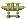
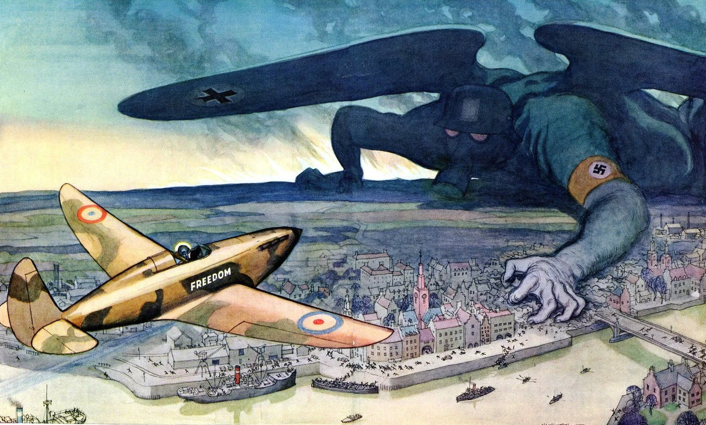

ΠΡΟΓΡΑΜΜΑΤΙΣΜΟΣ ΥΠΟΛΟΓΙΣΤΩΝ ΜΕ C++    
Ιστορική εργασία για το Χειμερινό Εξάμηνο 2020-2021   
Δε διασώζεται όλος ο κώδικας

# 1942 
*Παγωμένες ερπήστριες Γερμανικών panzer οργώνουν απέραντες εκτάσεις προς τα βάθη της Ρωσίας.    
Ιαπωνικά βομβαρδιστικά εξαπολύουν αιφνιδιαστική επίθεση στο Αμερικάνικο λιμάνι του Pearl Harbor.    
Η Μαύρη σκιά που απλώθηκε πάνω από την Ευρώπη, τώρα απειλεί να καλύψει ολόκληρο τον κόσμο.  
Οι μεγαλύτεροι στρατοί που κινητοποιήθηκαν ποτέ στην ιστορία, βρίσκονται στην πιο σφοδρή σύγκρουση
που έχει ζήσει ποτέ η ανθρωπότητα - στη γη, τον ουρανό, και τη θάλασσα.*

[Κατέβασέ το](https://github.com/odimos/1942/releases/tag/game)

Το artwork είναι από το επίσημο retro παιχνίδι
Για τις βασικές λειτουργίες game engine χρησιμοποιήθηκε η βιβλιοθήκη SGG  

Αρχιτεκτονική:

### Χρήση δυναμικής μνήμης
- Τα εχθρικά αεροσκάφη και τα βλήματα δημιουργούνται δυναμικά.
- Όταν καταστρέφονται ή απομακρύνονται αρκετά από την περιοχή του παιχνιδιού, η μνήμη τους αποδεσμεύεται.

### Κληρονομικότητα και Πολυμορφισμός
- Όλες οι οντότητες (παίκτης, εχθροί, βλήματα) κληρονομούν από τη βασική κλάση `Οντότητα`.
- Όλοι οι διαφορετικοί τύποι εχθρικών αεροσκαφών κληρονομούν από την κλάση `Εχθρός`.
- Μέθοδοι όπως η `update` καλούνται πολυμορφικά από μια κεντρική συλλογή που διαχειρίζεται αντικείμενα τύπου `Οντότητα`.

### Συλλογές
- Χρησιμοποιούνται δυναμικές λίστες για την αποθήκευση και τη διαχείριση των αντικειμένων του παιχνιδιού.

### Global State
- Υλοποιείται μοναδικό στιγμιότυπο (Singleton) της κλάσης `GlobalState`.
- Διαχειρίζεται την κεντρική κατάσταση και τα κοινά δεδομένα του παιχνιδιού.

### Σύστημα Συγκρούσεων
- Υλοποιείται σύστημα ανίχνευσης συγκρούσεων με γεωμετρικό τρόπο.
